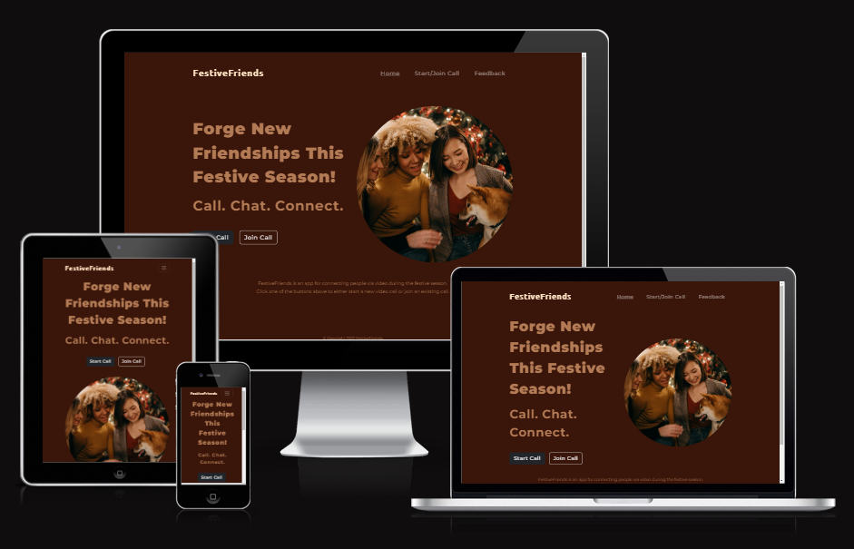
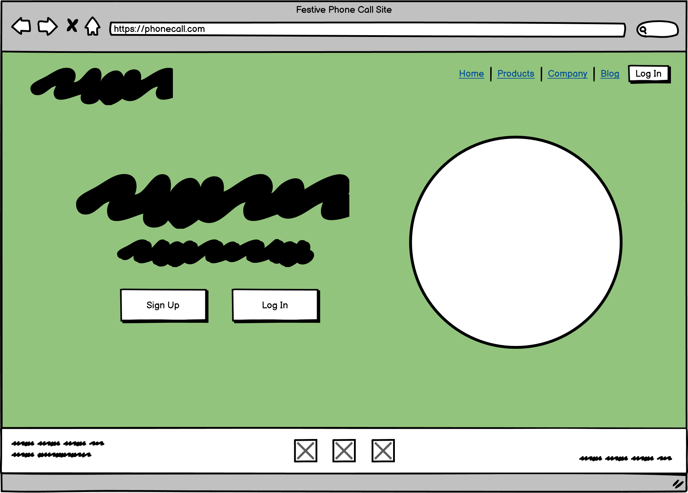
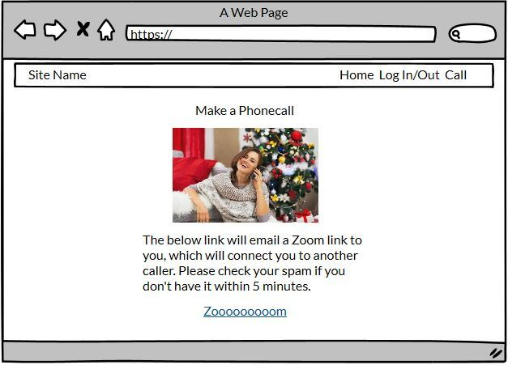
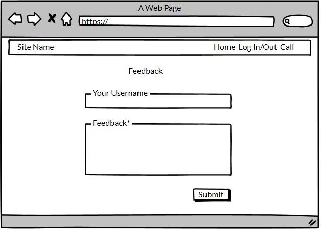
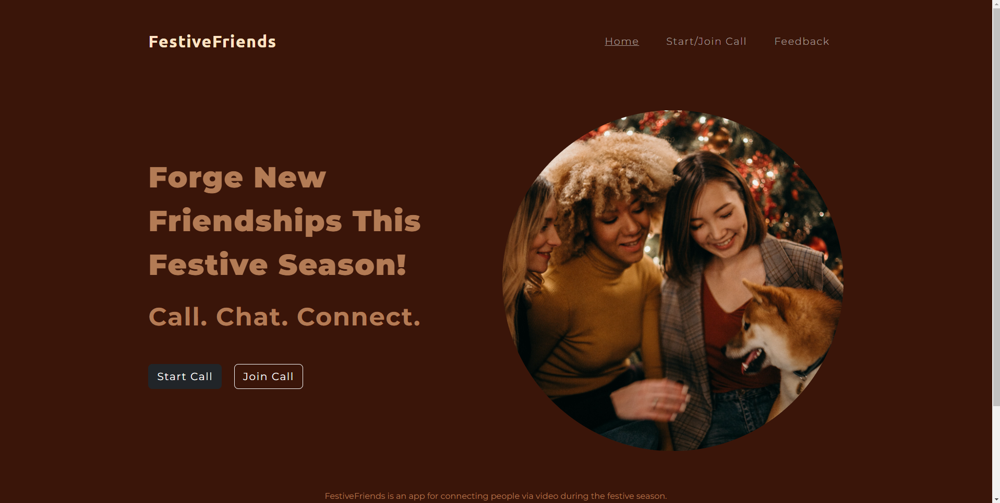
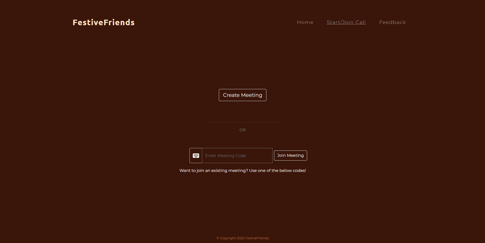
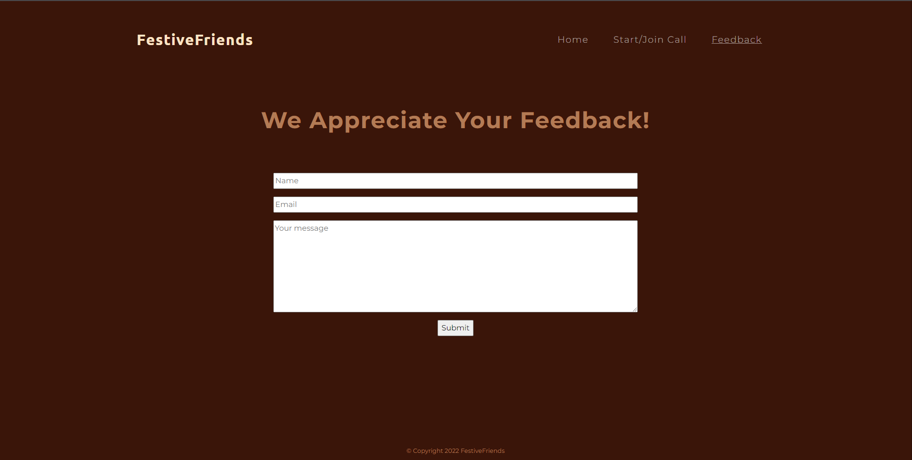
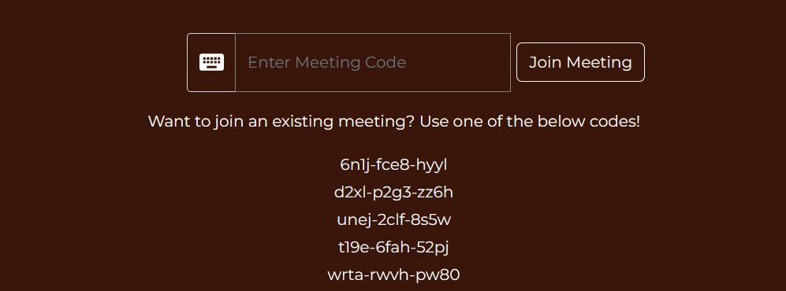

# Festive Friends
Festive Friends is a website where people can meet online to connect with one another via phone/video chat during the festive time. Meet new friends or connect with existing friends via the live chat function, or set up a call and have any of the other users join your call. Hang out and find new friends with the Festive Friends app this holiday season.

Live link: https://phonecall-site-seven.vercel.app/

### Am I Responsive?

[Am I Responsive](https://ui.dev/amiresponsive?url=https://phonecall-site-seven.vercel.app/)

## User Experience (UX)
## User Stories
* As a user I want to navigate easily through the website.
* As a user I want to see a landing page and have easy access to the main page/dashboard.
* As a user I want to generate a call and have other people join my call if they wish.
* As a user I want to be able to find other people to have call with.
* As a user I want to be able to start and stop calls on my own accord.
# Website Goals
* Serve as a way of people to connect with each other during the holiday period.
* Have the website be a tool for users to generate and join calls whenever they are online.
* Easy access on all kinds of devices..
* Provide clear information about what the website entails.
* Easily navigated and understood.
* Simple ways to connect to a call.
* Easily readable for everyone.
* Forms to work correctly.
### Design
#### Colors:
* Colors used on the website are:
* #1C1C15
* #934F3D
* #391510
* #AF7F73
* #393729
#### Fonts:
Fonts used on website are Montserrat and Ubuntu, from Google fonts.
Backup fonts is sans-serif if main font cannot be loaded for any reason.
#### Images:
Various images have been used to showcase the property. These images,
Website structure
| Screen size | Breakpoint |
|---|---|
|small      |>= 330px (mobile)|
|medium     |>=       |
|large      |>=       |
|extra large|>=       |
## Technology, Frameworks and Programs used.
### Languages
* HTML
* CSS
* JavaScript
#### Frameworks and Programs used.
* Google fonts was used to pick and import fonts to the project.
* GitHub and Git for storing repositories and manipulating code
* IDEs included Gitpod and VSCode
* Node.js to create server environment.
* VideoSDK for video calling.
* EmailJS for emailing the feedback form to site owners.
* Bootstrap to use certain CSS design frameworks for styling the webpage.
* Vercel for hosting the deployed site.
* Screenfly
Testing website.
Features
Responsive on all devices.
Interactive buttons
* Am I Responsive
To test various screen-size responsiveness.
# Sections of Website
1. Navigation Bar
2. Home/Index Page
3. Start/Join Call
5. Feedback
6. Footer

### Wireframes

### Screenshots

# Existing Bugs

In this current iteration, the joining list only displays in the HTML in development. Given a larger timeframe, in the next iteration we will offer this in it's entirety. The meeting code can still be copied and is still added to the JSON and .txt files.

# Resources

[VideoSDK Javascript Example](https://github.com/videosdk-live/videosdk-rtc-javascript-sdk-example)

[Bootstrap 5 documentation](https://getbootstrap.com/)

[EmailJS documentation](https://www.emailjs.com/docs/)

[Pexels image database](https://www.pexels.com/)